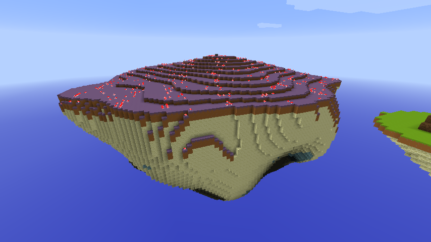

**Aetherial Drift** is a fun personal project, where I tried to experiment with procedural generation, and turned it into a minigame.

---

## Showcase: The Player Experience

Aetherial Drift is a team-based objective game where two teams, Sol and Luna, spawn on large, opposing base islands. The goal is to destroy the enemy's **Aether Core**. The path to victory is paved by bridging to smaller, resource-rich islands that dynamically form in the void, creating an ever-changing battlefield.

| Gameplay Moment                                               | Description                                                                                                                                                                                            |
|:--------------------------------------------------------------| :----------------------------------------------------------------------------------------------------------------------------------------------------------------------------------------------------- |
|     | **The Arena:** Players spawn on a vast, procedurally generated main island with a unique, magical block palette. The Aether Core, an Ender Crystal with a custom health bar, is the heart of the base.         |
|    | **The Drift:** The game's core mechanic. At timed intervals, new bridging islands form layer-by-layer in the void with a custom particle animation, creating new pathways and bringing resource hotspots into play. |
|  | **Regenerating Resources:** Key resources like wood and ores are placed as custom structures and veins. When harvested, they are temporarily depleted before respawning, creating strategic points to control.     |

---

## Dev Log: A Look Behind the Scenes

The goal for the main islands was to create a shape that was both aesthetically pleasing and highly functional for gameplay: a spiky base with a wide, relatively flat, and playable top surface. Early attempts using blended 3D noise functions failed, creating blob-like, uninteresting shapes.

**The Solution: A Unified Radius Falloff Function**

The final generator treats the island as a single, cohesive object. It calculates the island's maximum allowed **radius** at every single Y-level, using different mathematical curves for the top and bottom sections.

The `calculateRadiusAtHeight(y)` function is the core of this algorithm:
1.  **The Base:** For the bottom section (`y < 70`), it uses a **quadratic curve (`y = 1 - x^2`)**. This creates a concave shape that starts wide at the top and pulls in sharply at the bottom, forming the spike.
2.  **The Plateau:** For the top section (`y >= 70`), it uses a simple **linear falloff (`y = 1 - x`)**. The radius shrinks slowly and predictably, creating a gentle, playable slope for the plateau.
3.  **Noise as Detail:** A 3D noise function is then used not to define the shape, but to add detail, pushing and pulling the island's surface around the maximum radius calculated by the function.

This unified approach guarantees perfect cohesion between the top and bottom, avoids ugly seams or overhangs, and provides precise artistic control over the final shape.

---

## Features

*   **Multi-Version Support (1.8.8 & 1.21+):** Built on a multi-module Gradle architecture.
*   **Scalable Game Management:** A simple `ArenaManager` service can create, manage, and destroy multiple game instances simultaneously.
*   **State-Driven Game Logic:** A clean Finite State Machine architecture (`Lobby`, `Loading`, `Active`, `End`) ensures an easy debugging and code structuring process.
*   **Advanced Procedural World Generation:**
    *   Custom `ChunkGenerator` for creating main base islands.
    *   Unique island shaping algorithm using a unified radius falloff function for precise artistic control.
    *   Dynamic, animated bridging islands that form layer-by-layer during gameplay.
*   **Dynamic Gameplay Systems:**
    *   Regenerating custom resource nodes (wood piles and ore veins).
    *   Tiered resource islands (Wood, Iron, Gold, Diamond) that spawn progressively.